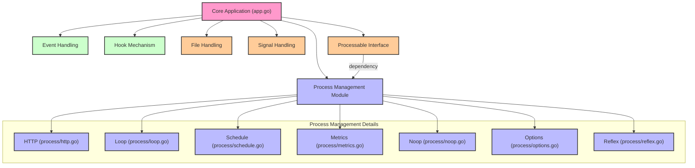

# lu

## What is it?
`lu` is an application framework

```mermaid
flowchart TD
    A["Core Application (app.go)"]:::core
    A --> B["Process Management Module"]:::module
    A --> C["Event Handling"]:::integration
    A --> D["Hook Mechanism"]:::integration
    A --> E["File Handling"]:::utility
    A --> F["Signal Handling"]:::utility
    A --> G["Processable Interface"]:::utility
    G -->|"dependency"| B

    subgraph "Process Management Details"
        B1["HTTP (process/http.go)"]:::module
        B2["Loop (process/loop.go)"]:::module
        B3["Schedule (process/schedule.go)"]:::module
        B4["Metrics (process/metrics.go)"]:::module
        B5["Noop (process/noop.go)"]:::module
        B6["Options (process/options.go)"]:::module
        B7["Reflex (process/reflex.go)"]:::module
    end

    B --> B1
    B --> B2
    B --> B3
    B --> B4
    B --> B5
    B --> B6
    B --> B7

    click A "https://github.com/luno/lu/blob/main/app.go"
    click B "https://github.com/luno/lu/tree/main/process/"
    click B1 "https://github.com/luno/lu/blob/main/process/http.go"
    click B2 "https://github.com/luno/lu/blob/main/process/loop.go"
    click B3 "https://github.com/luno/lu/blob/main/process/schedule.go"
    click B4 "https://github.com/luno/lu/blob/main/process/metrics.go"
    click B5 "https://github.com/luno/lu/blob/main/process/noop.go"
    click B6 "https://github.com/luno/lu/blob/main/process/options.go"
    click B7 "https://github.com/luno/lu/blob/main/process/reflex.go"
    click C "https://github.com/luno/lu/blob/main/event.go"
    click D "https://github.com/luno/lu/blob/main/hook.go"
    click E "https://github.com/luno/lu/blob/main/file.go"
    click F "https://github.com/luno/lu/blob/main/signals.go"
    click G "https://github.com/luno/lu/blob/main/processable.go"

    classDef core fill:#f9c,stroke:#333,stroke-width:2px;
    classDef module fill:#bbf,stroke:#333,stroke-width:2px;
    classDef integration fill:#cfc,stroke:#333,stroke-width:2px;
    classDef utility fill:#fc9,stroke:#333,stroke-width:2px;
```